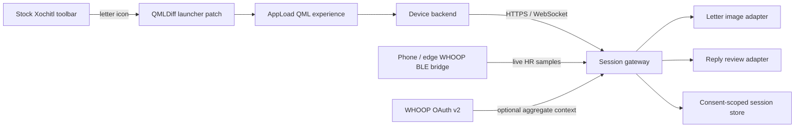

# Technical architecture

## Decision

Build a small, version-pinned AppLoad application and launch it from a QMLDiff-inserted toolbar icon. Do not write directly into reMarkable's proprietary notebook files for the first vertical slice.

This keeps the stock notebook application responsible for notebooks while the experience owns only its three-page session. It also matches the existing Xovi/QMLDiff setup and provides a rollback boundary.

## Components

### 1. Toolbar launcher

- QMLDiff patch against exact, hashed Xochitl/QRR resources for Ferrari and Chiappa on OS `3.28.0.162`.
- Adds only an icon and AppLoad launch action.
- Must coexist with the installed CJK font/language QMDs.
- A missing or mismatched hash must fail closed without changing the device.

The exact toolbar resource and insertion point are a reverse-engineering spike, not an assumption. Xochitl is proprietary and reMarkable does not promise patch compatibility between versions.

### 2. Tablet application

- Pure Qt Quick frontend compatible with AppLoad's supported Qt runtime.
- Device backend follows AppLoad's Unix-socket frontend/backend protocol; Rust is preferred because the maintained example and client library use it.
- Three explicit states: `incoming`, `reply`, `marginalia`.
- Session state is recoverable after frontend restart and erased according to retention policy.
- Stroke capture is behind a `StrokeSource` interface so host tests use deterministic fixtures while hardware input remains an integration adapter.

### 3. Session gateway

The tablet never contains OpenAI or WHOOP client secrets. The gateway owns:

- image generation requests and caching;
- stroke/transcript review requests;
- WHOOP OAuth token exchange and refresh;
- ingestion from the live BLE relay;
- consent, retention, deletion, and installation export.

Provider-facing code must sit behind interfaces with deterministic fakes:

- `LetterImageProvider`: `FixtureLetterImageProvider`, later `OpenAIImageProvider`;
- `ReplyReviewer`: `FixtureReplyReviewer`, later an approved model-backed reviewer;
- `HeartRateSource`: `MockHeartRateSource`, `BleRelayHeartRateSource`, `WhoopAggregateSource`.

### 4. Heart-rate capture

WHOOP's public cloud API exposes cycle/workout summaries such as average and maximum heart rate, not continuous live heart rate. WHOOP devices can broadcast the standard BLE Heart Rate Service. Because both target reMarkables lack Bluetooth, a phone or edge computer must listen to BLE and relay samples to the gateway.

Capture semantics:

1. Create the session before page 1.
2. Start the biometric window on the first accepted pen stroke, not on app launch.
3. Store samples with source timestamp, gateway receipt timestamp, BPM, optional RR interval, source, and quality flags.
4. Close the window atomically with reply submission.
5. Preserve gaps and reconnect events; never invent samples or interpolate silently.
6. Permit `declined` and `unavailable` sessions to complete normally.

### 5. AI image and review

- Use the Image API with `gpt-image-2` for the single-prompt incoming asset when the live provider is enabled.
- Render profiles request model-valid dimensions and deterministically crop/pad to device dimensions.
- Image prompts include provenance and anti-copy constraints.
- The review service returns structured annotations, never a replacement image as its only output.
- Annotation coordinates are normalised to page space and overlaid locally so the participant's original strokes remain intact.

## Render profiles

| Device | Native landscape | Requested generation | Transform |
|---|---:|---:|---|
| Paper Pro / Chiappa | 2160 × 1620 | 2160 × 1616 | pad 2 px top and bottom |
| Paper Pro Move / Ferrari | 1696 × 954 | 1696 × 960 | crop 3 px top and bottom |

Portrait orientation swaps the final native dimensions after transformation. Generation dimensions remain within GPT Image 2's documented custom-size constraints: edges divisible by 16, ratio at most 3:1, and total pixels within the supported range.

The machine-readable source is [`contracts/render-profiles.json`](../contracts/render-profiles.json).

## Session data model

Minimum fields:

- pseudonymous `session_id`;
- `letter_fixture_id` and generation provenance, not an archival accession claim;
- `created_at`, `first_ink_at`, `submitted_at`;
- ordered reply strokes or an encrypted object reference;
- annotation payload and reviewer version;
- heart-rate consent state, samples, gaps, and source;
- retention deadline and deletion status.

The existing session `retention_deadline` is the operational deadline. Optional
installation retention is represented separately and requires its own consent
decision and deadline; it never silently extends storage of operational ink or
raw biometrics. The fixture implementation and threat model are documented in
[`privacy-data-flow.md`](privacy-data-flow.md).

Do not store WHOOP email/profile fields by default. Do not put participant ink, heart-rate samples, OAuth tokens, prompts containing personal data, or provider responses into GitHub issues, PRs, CI logs, or Rucksack evidence.

## Security and privacy boundary

- Participant can proceed without biometric capture.
- Notify purpose before connection; record consent version and withdrawal.
- Separate optional research/installation retention from what is required to render page 3.
- Encrypt transport and stored sensitive session objects; rotate identifiers between installations.
- Provide deletion by session receipt and enforce a configured retention deadline.
- Treat withdrawal as deletion, retry partial per-category deletion, and allow no
  tombstone unless a reviewed aggregate approval is explicitly recorded.
- Keep tokens in the trusted secret store, not `.env` files committed to the repository.
- Do not expose the gateway directly from the VM until private networking and an approved publication boundary are verified.

## Installation boundary

The current devices are backed up and patched on exactly OS `3.28.0.162`. Xovi is not boot-persistent, and the stock screenshot helper must not be run under Xovi because it can restart Xochitl. Hardware evidence must use a reviewed framebuffer/AppLoad method and a manual rollback rehearsal.

No autonomous worker may:

- SSH to a physical tablet;
- stop or restart Xochitl;
- install or remove QMDs;
- reboot a tablet;
- enable developer mode;
- run a live OpenAI/WHOOP request;
- publish a participant endpoint;

without an explicit human-approved issue gate.
