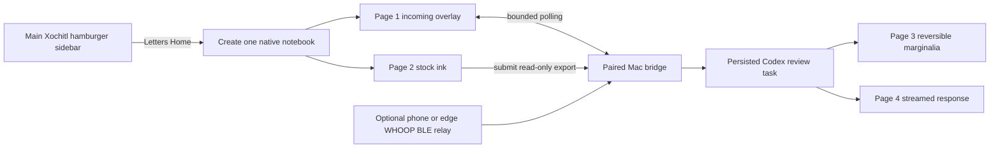

# Technical architecture

## Decision

Each encounter is one stock Xochitl notebook, created in the user's current
folder and opened through the normal `DocumentView`. It starts with two native
pages and finishes with four:

1. incoming fictional letter;
2. writable huipi;
3. copied huipi with reversible marginalia;
4. reciprocal response letter.

QMLDiff adds the main-sidebar entry and non-interactive page overlays, but it
does not replace Xochitl's pen toolbar, close action, swipe-down menu, page
navigation, or gesture handlers. The paired Mac owns Codex and session state.
It may export a read-only rendering of page 2 for review; it never imports a
PDF, uploads a reviewed replacement, or edits Xochitl's document store.

## Device contract

### Exact Ferrari resources

Ferrari OS `3.28.0.162` is the only physically eligible target in this slice.
The recovered source hashes, resource identifiers, and obfuscated method
symbols are pinned in
`contracts/native-notebook-api.ferrari-3.28.0.162.json`. The trial bundle
copies that contract beside the QMLDiffs. A mismatched Xochitl binary, QRR
hashtable, recovered source, target version, or active patch order must fail
closed before mutation.

Chiappa remains a separate exact-version target. Matching-looking bytes or
layout dimensions do not authorize reuse of the Ferrari contract.

### Notebook creation and binding

The sidebar QMLDiff:

- asks the private Mac bridge to start a session;
- calls `LibraryController.createDocument` in
  `NavigationManager.activeContext.explorer.currentFolderId`;
- assigns the full-page `letters-home-ferrari` template and adds page 2;
- resolves both native page ids with `document.idForPage`;
- binds those ids to the session; and
- opens the same document through `legacydevice/window/main` only after bind.

A bridge or bind failure restores the sidebar label and leaves normal Xochitl
navigation available. It does not create or import a fallback PDF.

### Pages and interaction ownership

The document-view QMLDiff adds one non-interactive layer before the stock
toolbar:

- Page 1 paints cumulative, already-laid-out glyphs from the bridge on a fixed
  Ferrari `954×1696`, `10×18` vertical grid. Text runs top-to-bottom and
  columns right-to-left. Polling is e-ink-safe and bounded.
- Page 2 is an ordinary native ink page. Exactly one connection to the stock
  pen handler records the first completed stroke. A floating `寄出` action is
  positioned clear of either stock toolbar orientation and exists only here.
- On submit, Xochitl copies page 2 to page 3 with
  `DocumentController.copyPages`, then adds the templated page 4 with
  `DocumentController.addPageWithTemplateAndPageSize`.
- Page 3 paints only grounded correction geometry and a compact review note.
  Red is reserved for high-confidence corrections; uncertain readings remain
  neutral. Page 2 and its ink are never changed.
- Page 4 paints the cumulative reciprocal response on the same `10×18` grid.
  The response contract must fit one page.

The layer has no `MouseArea`, `TapHandler`, custom gesture window, or
`toolbarProvider.editingTools` mutation. Auto-advance occurs at most once and
only if the participant has not navigated away themselves.

## Paired Mac bridge

The bridge binds only to the Mac side of the private USB link. A deterministic
LaunchAgent (`com.erniesg.letters-home.bridge`) supervises it with an explicit
Python interpreter and a minimal environment. Installation is hash-owned,
rollback-safe, and accepted only after health confirms the listener, tablet
route, renderer, and signed-in desktop Codex executable.

The active notebook path requires only the Python standard library,
`pdftoppm`, and desktop Codex. Pillow, pypdf, and reportlab remain optional
legacy compatibility dependencies and are not startup requirements.

The bridge owns:

- restart-safe session and submit receipts containing identifiers only;
- incoming-letter generation and cumulative stable text deltas;
- read-only USB export of the open notebook and page-2 rasterization;
- one persisted review task, followed by a response turn in the same task;
- normalized review geometry and the bounded response-letter contract; and
- optional consented heart-rate ingestion.

Provider-facing code remains behind deterministic fakes for required tests.
Participant ink, correspondence text, image bytes, biometric samples, provider
payloads, and secrets must never enter logs, evidence, issues, or PR bodies.

## Heart-rate boundary

Capture starts on the first accepted ink stroke and closes atomically at
submit. Samples retain source time, receipt time, BPM, optional RR interval,
source, quality, gaps, and reconnect events. No sample may be invented or
silently interpolated. `declined` and `unavailable` sessions complete normally.

WHOOP cloud summaries are not a live beat stream. A future live installation
therefore uses a consented phone or edge listener for the standard BLE Heart
Rate Service; neither target tablet has Bluetooth.

## Safety and installation boundary

The current devices are backed up and pinned to OS `3.28.0.162`. Xovi is not
boot-persistent, and the stock reMarkable screenshot helper must not run while
Xovi is active. Hardware evidence uses a reviewed framebuffer/AppLoad method
or direct owner observation.

No autonomous worker may SSH to a physical tablet, install or remove QMDs or
templates, restart Xochitl, reboot a tablet, enable developer mode, install the
Mac LaunchAgent, make a live Codex/WHOOP request, or publish an endpoint without
the explicit human-approved live-trial checkpoint.
